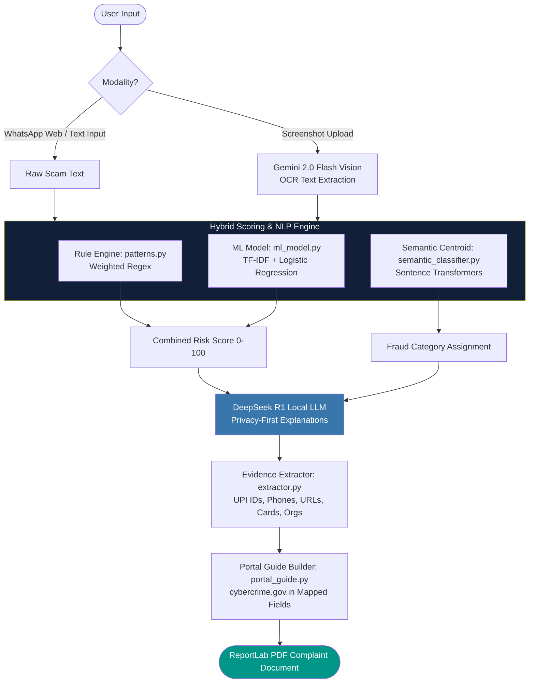

<div align="center">


<br/><br/>

# 🛡️ RiskRadar AI

### *Your AI-Powered Shield Against Digital Financial Fraud*

**"Detect and document financial scams in real-time, right from your browser."**

RiskRadar AI is a full-stack, AI-powered fraud detection and cybercrime assistance platform built for the Indian digital ecosystem. It combines rule-based pattern matching, machine learning, and large language models (LLMs) to help everyday users identify scam messages, extract forensic evidence, and file cybercrime complaints — all in one place.

<br/>

[](https://github.com/Basavaraj8143/Riskrader-BGK-Hackathon)
[](http://localhost:8000/docs)

</div>

---

## 📺 Demo Overview

RiskRadar AI is designed to combat India's fastest-growing problem: **online financial fraud via UPI, KYC phishing, investment scams, loan app abuse, and impersonation fraud.** By utilizing a zero-copy Chrome Extension combined with a multi-layered FastAPI analytics engine, users are protected instantly where they chat.

---

## 🚨 The Problem

Traditional spam filters rely on static word blacklists. Modern fraudsters bypass these filters easily by altering terminology, switching channels, or using urgent authorities.

| Year | Scam Variant | Simple Keyword Filter | RiskRadar AI Hybrid Scoring |
|------|--------------|-----------------------|-----------------------------|
| **2021** | *"Your SBI account is blocked. Call 98765xxxxx to update KYC."* | ✅ Caught (via "KYC") | ✅ Caught (Rule Pattern Match) |
| **2023** | *"Avoid electricity connection cutoff. Pay immediately via UPI link."* | ❌ Missed (No KYC keywords) | ✅ Caught (Semantic Centroid + Regex) |
| **2025** | *"Avoid profile suspension. Complete biometric re-verification immediately."* | ❌ Missed (No traditional triggers) | ✅ Caught (ML Classifier + LLM analysis) |

<br/>

> Keywords describe *what was said.* Scammers constantly mutate words.  
> RiskRadar AI maps *what was meant* — combining semantic similarity with machine learning to identify fraud vectors.

---

## 🏗️ Ingestion & Analysis Pipeline

Below is the execution flow from the moment a suspicious message or screenshot is ingested to the generation of a forensic cybercrime complaint:



---

## 🧬 Core Architecture & AI Engine

RiskRadar AI uses a hybrid, multi-layered approach to evaluate the risk score (0–100) of incoming messages:

```
┌─────────────────────────────────────────────────────────────┐
│                 RISKRADAR AI HYBRID SCORE                   │
├──────────────────────────────┬──────────────────────────────┤
│      RULE-BASED REGEX (50%)  │      ML CLASSIFIER (50%)     │
│   - 12+ categories           │   - TF-IDF Vectorizer        │
│   - Weighted score mapping   │   - Logistic Regression      │
│   - Instant deterministic    │   - Trained on Indian corpus │
└──────────────────────────────┴──────────────────────────────┘
                         ║
                         ▼
             [ SEMANTIC CLASSIFICATION ]
       Sentence Transformers (all-MiniLM-L6-v2)
     Assigns category based on centroid cosine sim
```

### 1. Hybrid Fraud Scoring ([scorer.py](file:///d:/projects/subprojects/bgkhack/backend/engine/scorer.py))
Every message is evaluated on a 0–100 scale. If the machine learning model files are missing, the scorer gracefully falls back to rule-only pattern scoring.

### 2. Semantic Classifier ([semantic_classifier.py](file:///d:/projects/subprojects/bgkhack/backend/engine/semantic_classifier.py))
Computes cosine similarity against "Semantic Centroids" (reference templates) for 12 distinct fraud families using the `all-MiniLM-L6-v2` transformer model. This flags variants utilizing synonyms, typos, or varying sentence structures.

### 3. ML Model ([ml_model.py](file:///d:/projects/subprojects/bgkhack/backend/engine/ml_model.py) + [train.py](file:///d:/projects/subprojects/bgkhack/backend/engine/train.py))
A vectorization pipeline utilizing TF-IDF and a Logistic Regression classifier trained on a purpose-built dataset of Indian scam messages ([india_fraud_detection_FINAL.csv](file:///d:/projects/subprojects/bgkhack/backend/engine/india_fraud_detection_FINAL.csv)).

---

## ✨ Key Features & Capabilities

### 1. 🔌 Zero-Copy Chrome Extension
A companion Chrome extension injected directly into WhatsApp Web.
* **DOM Monitoring:** Utilizes a `MutationObserver` to automatically hook into new chats and incoming messages.
* **Floating Widget:** Seamless CSS overlay providing analysis options with hotkeys (`Alt+Shift+G` to toggle, `Alt+Shift+A` to analyze selected chat).
* **Instant API Hook:** Queries the local FastAPI service to display risk scores, classifications, and explanations directly on screen.

### 2. 🔍 Forensic Evidence Extractor ([extractor.py](file:///d:/projects/subprojects/bgkhack/backend/engine/extractor.py))
Scans raw text or OCR outputs to identify key suspect indicators:
* **UPI IDs:** Scans for standard virtual payment handles using strict and lenient filters.
* **Financial Details:** Extracts monetary numbers, bank account keywords, and 16-digit card patterns.
* **Contacts & Links:** Captures Indian phone formats (with `+91` or `0091` prefixes), URLs, and email addresses.
* **Impersonations:** Matches known institutions (e.g., SBI, HDFC, TRAI, Amazon, Jio).

### 3. 🛡️ Privacy-First LLM Explanations ([ollama_client.py](file:///d:/projects/subprojects/bgkhack/backend/engine/ollama_client.py))
* **Local DeepSeek R1:** The critical `/api/analyze` and `/api/extract-evidence` endpoints run DeepSeek R1 (1.5b) locally via Ollama. 
* **Cloud Fallback:** The deep Encyclopedia research page ([Encyclopedia.jsx](file:///d:/projects/subprojects/bgkhack/frontend/src/pages/Encyclopedia.jsx)) uses Gemini 2.0 Flash to compile fraud briefs and news trends.

### 4. 📝 Cybercrime Portal Assistant ([portal_guide.py](file:///d:/projects/subprojects/bgkhack/backend/engine/portal_guide.py) + [gen_com.py](file:///d:/projects/subprojects/bgkhack/backend/engine/gen_com.py))
Converts extracted evidence into a step-by-step assistant matching the input fields of `cybercrime.gov.in`:
* Maps extracted suspects (UPI, phone, links) into designated form sections.
* Auto-generates formal PDF complaints styled using ReportLab flowables, prepared for local download and offline submission.

---

## 🗂️ Project Directory Structure

```
bgkhack/
├── backend/                        ← FastAPI Python backend
│   ├── main.py                     ← REST API endpoints & cors setup
│   ├── requirements.txt            ← Python dependencies (torch, sklearn, transformers)
│   ├── services/
│   │   └── news_fetcher.py         ← NewsAPI fetcher with local caching
│   └── engine/
│       ├── patterns.py             ← 12+ categories of weighted regex patterns
│       ├── scorer.py               ← Hybrid risk scoring orchestrator (Rules + ML)
│       ├── semantic_classifier.py  ← Sentence Transformers semantic encoder
│       ├── ml_model.py             ← TF-IDF Vectorizer + Logistic Regression loading
│       ├── train.py                ← Scikit-learn model trainer script
│       ├── extractor.py            ← Forensic UPI/phone/URL entity parser
│       ├── gemini_explainer.py     ← Google Gemini Explainer (Research Lab)
│       ├── ollama_client.py        ← Local DeepSeek R1 integration client
│       ├── portal_guide.py         ← Fields mapper for cybercrime.gov.in
│       └── gen_com.py              ← ReportLab PDF complaint generator
│
├── frontend/                       ← React + Vite SPA frontend
│   ├── src/
│   │   ├── main.jsx                ← App bootstrap
│   │   ├── App.jsx                 ← Router config & Navigation layout
│   │   ├── index.css               ← Custom glassmorphism dark styles
│   │   └── pages/
│   │       ├── Extension.jsx       ← Chrome Extension download page (Landing Page)
│   │       ├── Analyzer.jsx        ← Ad-hoc message risk tester
│   │       ├── Evidence.jsx        ← Multi-step screenshot OCR & complaint builder
│   │       ├── Encyclopedia.jsx    ← Broad research lab powered by Gemini
│   │       └── About.jsx           ← Detailed technical platform specifications
│   └── package.json
│
└── extension/                      ← Chrome Extension for WhatsApp Web
    ├── manifest.json               ← Manifest v3 configuration
    ├── content.js                  ← Injected script monitoring DOM & DOM queries
    ├── styles.css                  ← WhatsApp Web UI overlays
    └── icons/                      ← Brand assets
```

---

## 🔌 API Endpoints Reference

| Method | Endpoint | Description | Payload Input / Output |
|--------|----------|-------------|-------------------------|
| `GET` | `/api/health` | Service health check | Returns API running status. |
| `POST` | `/api/analyze` | Ingests a text message; returns hybrid score, classification, and local DeepSeek explanation. | **Req:** `{ "message": "str" }` <br> **Res:** `{ "score": 85, "level": "HIGH", "category": "KYC Phishing", "explanation": "str", "prevention_tips": [...] }` |
| `POST` | `/api/extract-evidence` | Parses raw text or base64 screenshots (OCR). Extracts entities and constructs portal guide details. | **Req:** `{ "text": "str?", "image_base64": "str?" }` <br> **Res:** `{ "ocr_text": "str", "entities": {...}, "portal_guide": {...} }` |
| `POST` | `/api/research` | High-latency deep research query. Uses Gemini 2.0 and gathers matching News trends. | **Req:** `{ "message": "str" }` <br> **Res:** `{ "explanation": "str", "related_news": [...] }` |
| `GET` | `/api/download-extension` | Compiles the Chrome Extension on-the-fly into a ZIP archive and streams it. | **Res:** `application/zip` binary attachment |
| `GET` | `/api/trends` | Fetches NewsAPI entries on Indian cyber fraud, cached locally. | **Res:** `{ "headlines": [...], "alert_level": "HIGH", "top_category": "str" }` |
| `GET` | `/api/stats` | Fetches session counters (e.g. analyzed messages, prevented scams). | **Res:** `{ "total_analyzed": 1284, "high_risk_today": 312, ... }` |
| `POST` | `/api/generate-pdf` | Takes portal guide fields and returns the binary PDF stream. | **Req:** `{ "guide": {...} }` <br> **Res:** `application/pdf` binary |

---

## 🚀 Quick Start & Installation

### Prerequisites
* **Python 3.11+**
* **Node.js 18+**
* **Ollama** running locally.

### Step 1: Clone the Repository & Configure Environment
1. Clone the project to your local machine:
   ```bash
   git clone https://github.com/Basavaraj8143/Riskrader-BGK-Hackathon.git
   cd Riskrader-BGK-Hackathon
   ```
2. Create and configure your environment variables:
   Create `backend/.env` containing:
   ```env
   GEMINI_API_KEY=your_gemini_api_key_here
   NEWS_API_KEY=your_news_api_key_here
   ```

### Step 2: Configure and Start Local LLM (Ollama)
1. Download [Ollama](https://ollama.com).
2. Download the DeepSeek model:
   ```bash
   ollama pull deepseek-r1:1.5b
   ```
3. Keep the Ollama desktop application or daemon running in the background.

### Step 3: Set Up and Run FastAPI Backend
1. Initialize virtual environment and install backend dependencies:
   ```bash
   cd backend
   python -m venv venv
   # Windows Activation:
   venv\Scripts\activate
   # Linux/macOS Activation:
   source venv/bin/activate

   pip install -r requirements.txt
   ```
2. Train the Scikit-learn model using the local seed corpus:
   ```bash
   python -m engine.train
   ```
3. Start the FastAPI server:
   ```bash
   uvicorn main:app --reload --port 8000
   ```
   *FastAPI Swagger documentation will be available at [http://localhost:8000/docs](http://localhost:8000/docs).*

### Step 4: Set Up and Run React Frontend
1. Open a new terminal session, navigate to the frontend directory, and start the Vite development server:
   ```bash
   cd frontend
   npm install
   npm run dev
   ```
2. Access the main web interface at [http://localhost:5173](http://localhost:5173).

### Step 5: Install WhatsApp Web Chrome Extension
1. Open Google Chrome and navigate to `chrome://extensions/`.
2. Toggle **Developer mode** (top-right corner).
3. Click **Load unpacked** (top-left corner).
4. Select the `extension` folder inside your cloned `Riskrader-BGK-Hackathon` directory.
5. Log in to [WhatsApp Web](https://web.whatsapp.com). The RiskRadar shield widget will load in the interface automatically. Use `Alt+Shift+G` to toggle the extension menu.

---

*Built to protect and defend users against digital financial fraud.*
